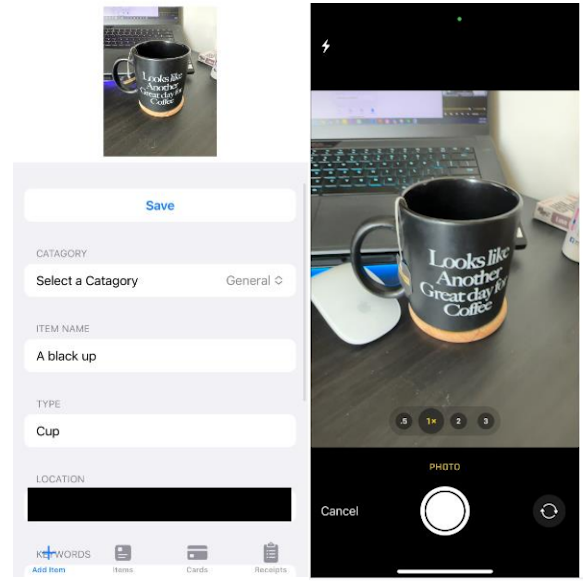
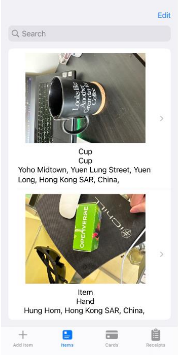
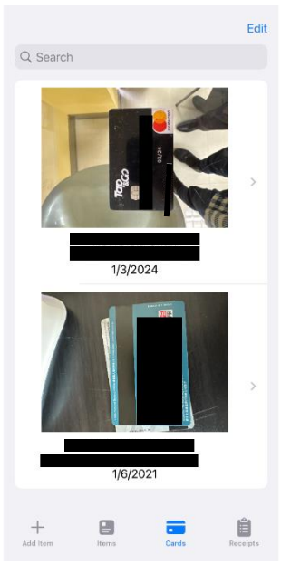
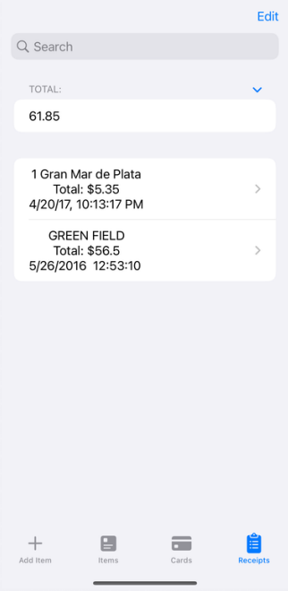
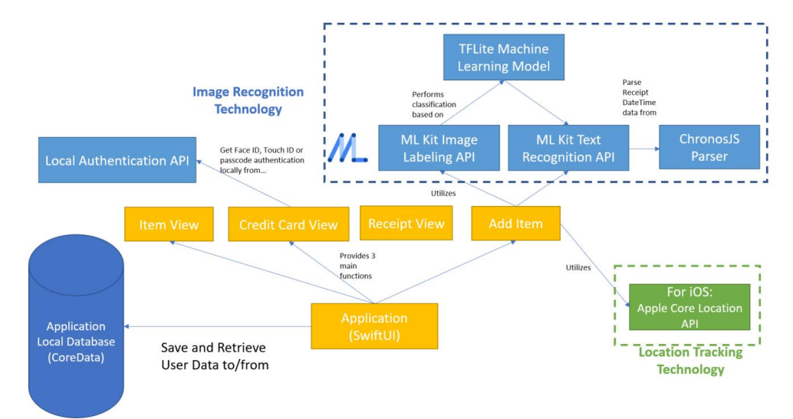
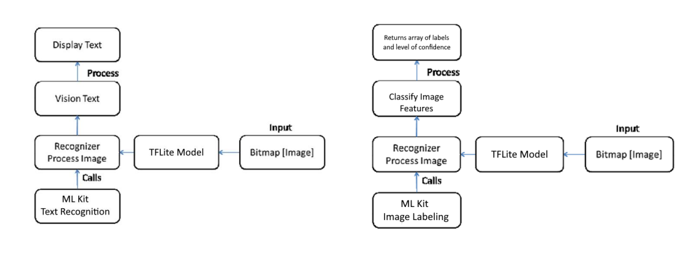
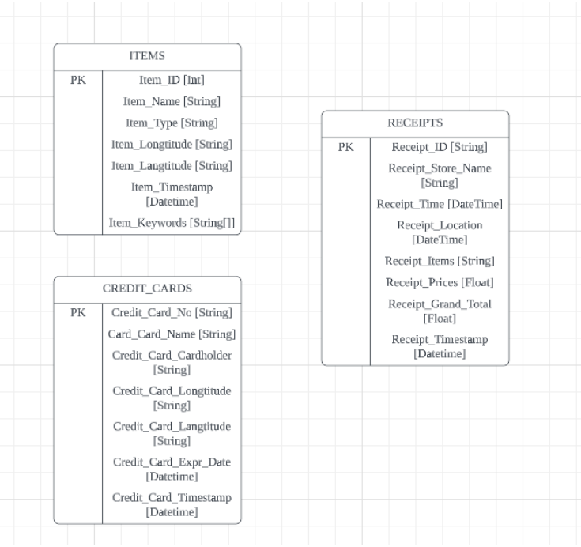

# "WheresApp" – An Object Detection App using Machine Learning

## Overview

This project is an iOS App designed to identify objects with just their smartphone hardware – using machine learning approaches with Google ML Kit and allowing users to track the location of objects. The app is using SwiftUI framework.

## Main Features

### Add Item View

Allows the user to take a picture and add item entries.

The add item function contains three mode: “General”, “Credit Card” and
“Receipts”. Depending on the mode, the app will perform image analysis and
generate different results.

### Item List View
Shows a list of general items added by the user.

When the user taps on the item, it can review the item’s name, type (from
image labeling), location, and keywords.

The search bar in this view searches by the item’s name or type or keywords. 

### Credit Card List View

Shows a list of credit card items added by the user.

When the user taps on this tab, the user have to authenticate its identity using
biometrics (Face ID or Touch ID) in order to access this view.

When the user taps on the item, it can review the item’s credit card no, credit
card name, credit card expiry date, location it was taken.

The search bar in this view searches by the item’s credit card no, name, and
expiry date.

### Receipts List View

Shows a list of receipt items added by the user.

When the user taps on the item, it can review the receipt’s store name, time,
location, price of each item, and the grand total of the receipt.

The search bar in this view searches by the item’s store name.

Below the search bar, there is a field showing the total amount of expenditures
accumulated by the user.

## Application Architecture

There are four main components in this application. 

The main application developed in SwiftUI (**component 1**) provides the function of Item View, Credit Card View, Receipt View and Add Item View. By default, the app will launch the item view.

These functions will retrieve data from the application’s local database in CoreData (**component 2**) to display the items, credit cards or receipts added by the “Add Item” function. 

The “Add Item” function of component 1 utilizes image recognition technology, from Google ML Kit’s “Image Labeling” and “Text Recognition” API (**component 3**),which performs classification using TensorFlow Lite machine learning model. The “add item” function of component 1 also utilizes location tracking technology (**component 4**), which consists of Apple’s Core Location API to obtain the precise location of the image taken by the device.

For cases where user scans the receipt, the application will obtain the location from the scanned image of the receipt itself. After the text is
parsed by Google ML Kit’s Text Recognition API, the data is parsed by a natural language based parser “ChronoJS” to obtain the string of the date time as shown on the receipt, and converts it into a Swift DateTime object for formatting.

## Image Labeling and Text Recognition

This app detects the type of an object and the keywords of an object **on device**, in other words, the app does not connect to the internet and process the image on a server.

To accomodate the hardware specifications of smartphone, the text recogition and image labeling modules of Google ML Kit is adopted. The model TFLite is used for its low requirements on processing speed.

Block diagram of how an image is processed when an item is added in the add item view:

## ER Diagram for the App's Local Database

 